# Genu Library -- Frontend

**Last Updated**: 2026-09-15


---

<p align="center">
  
</p>

<p align="center">
  <em>A fantasy-themed digital library platform built with the "Forge & Guild" aesthetic — warm browns, amber accents, parchment textures, and the language of artisans and archivists.</em>
</p>

---

## Table of Contents

1. [What This Is](#1-what-this-is)
2. [Tech Stack](#2-tech-stack)
3. [How It Works (Architecture)](#3-how-it-works-architecture)
4. [Project Structure](#4-project-structure)
5. [Design System](#5-design-system)
6. [UI Showcase](#6-ui-showcase)
7. [Every Page -- What It Does](#7-every-page--what-it-does)
8. [Every Component -- What It Does](#8-every-component--what-it-does)
9. [API Client Layer](#9-api-client-layer)
10. [Data Flow -- How a Request Travels](#10-data-flow--how-a-request-travels)
11. [Authentication System](#11-authentication-system)
12. [Routing Map](#12-routing-map)
13. [Configuration Files](#13-configuration-files)
14. [Docker](#14-docker)
15. [Local Development Setup](#15-local-development-setup)
16. [Known Limitations & TODOs](#16-known-limitations--todos)

---

## 1. What This Is

This is the **frontend** for the Genu Library digital platform -- a fantasy-themed book library where users browse, upload, rate, comment on, and organize books into playlists. The UI uses a dark "forge & guild" aesthetic: warm browns, amber accents, parchment textures, and terminology like "Codex", "Guild", "Archivist", "Folio".

It is a **Next.js 14 App Router** single-page application. It talks to a Django REST Framework backend API via REST calls. There is no server-side rendering of data beyond initial page fetches -- most interactivity is handled by React Client Components.

**Key user capabilities:**
- Browse, search, and filter books by tag
- View book detail with PDF viewer, ratings, comments
- Create, edit, and delete books (with cover image + PDF upload)
- Create and manage playlists
- User registration, login, profile management
- Bulk upload books and tags (admin tool)
- Report books for violations

---

## 2. Tech Stack

| Layer | Technology | Version | Purpose |
|-------|-----------|---------|---------|
| **Framework** | Next.js | 14.2.22 | App Router, SSR, standalone output |
| **UI Library** | React | 18.3.x | Component rendering, hooks |
| **Language** | TypeScript | 5.6.x | Type safety, editor support |
| **Styling** | Tailwind CSS | 3.4.16 | Utility-first CSS |
| **PostCSS** | autoprefixer | latest | Browser prefix normalization |
| **Fonts** | Google Fonts | -- | Inter, Playfair Display, JetBrains Mono |
| **Icons** | Material Symbols | -- | Variable font icons (outlined) |
| **Build** | Node.js | 20 (Alpine) | Docker base image |
| **Backend** | Django DRF | -- | Separate service at port 8080 |

**No runtime dependencies** beyond React and Next.js. No state management library (Redux, Zustand, etc.) -- all state is component-local via `useState`/`useCallback`/`useMemo`. No data fetching library (SWR, React Query) -- raw `fetch` via the custom API client.

---

## 3. How It Works (Architecture)

### The Big Picture

```
User's Browser
     |
     | HTTP requests (REST API calls)
     v
+------------------+          +-------------------+
|  Next.js App     |  ----->  |  Django REST API   |
|  (port 3001)     |  fetch   |  (port 8080)       |
|  Tailored UI     |  <-----  |  JSON responses    |
+------------------+          +-------------------+
                                      |
                                      v
                               +-------------------+
                               |  SQLite Database   |
                               |  (data/db.sqlite3) |
                               +-------------------+
```

### Rendering Strategy

The app uses a **hybrid rendering** approach:

1. **Server Components** (the `page.tsx` files): These run on the Next.js server at request time. They fetch data from the backend API and pass it down to Client Components. Examples: `app/books/page.tsx`, `app/page.tsx`, `app/playlists/page.tsx`.

2. **Client Components** (files with `"use client"` at the top): These run in the browser. They handle all user interaction -- forms, modals, carousels, search, filtering, favoriting, rating. Examples: `BookListClient.tsx`, `Header.tsx`, `FeaturedCarousel.tsx`.

**Why this split?** Server Components fetch data without sending API keys to the browser, reduce client-side JavaScript, and improve initial page load. Client Components handle all the interactive stuff.

### Request Flow for a Page Load

```
1. User navigates to /books/the-silent-patient
2. Next.js server runs app/books/[slug]/page.tsx (Server Component)
3. Server Component calls books.detail("the-silent-patient")
   -> This hits the backend at http://backend:8080/v1/api/books/the-silent-patient/
4. Backend returns JSON with book data
5. Server Component passes data to <BookDetailClient book={data} />
6. Next.js sends the rendered HTML to the browser
7. Client hydrates -- BookDetailClient takes over for interactivity
```

---

## 4. Project Structure

```
Library-frontend/
|-- app/                          # Next.js App Router pages
|   |-- layout.tsx                # Root layout (fonts, metadata, ToastProvider)
|   |-- page.tsx                  # Homepage (hero, featured, recent, stats)
|   |-- globals.css               # Tailwind directives + base styles
|   |-- FeaturedCarousel.tsx      # Horizontal auto-scrolling carousel
|   |-- (auth)/                   # Auth route group (no URL segment)
|   |   |-- layout.tsx            # Minimal wrapper for auth pages
|   |   |-- login/page.tsx        # Login form
|   |   |-- register/page.tsx     # Registration form
|   |   |-- forgot-password/page.tsx  # Forgot password (placeholder)
|   |-- books/                    # Book management
|   |   |-- page.tsx              # Book catalog (server fetch)
|   |   |-- BookListClient.tsx    # Search, filter, sort, paginate books
|   |   |-- new/page.tsx          # Create new book (4-phase form)
|   |   |-- [slug]/               # Dynamic book routes
|   |       |-- page.tsx          # Book detail (server fetch)
|   |       |-- BookDetailClient.tsx  # Full detail: PDF, rating, comments
|   |       |-- PdfViewer.tsx     # Mock PDF reader with controls
|   |       |-- edit/page.tsx     # Edit book metadata
|   |       |-- delete/page.tsx   # Delete confirmation page
|   |-- playlists/                # Playlist management
|   |   |-- page.tsx              # Playlist catalog (server fetch)
|   |   |-- PlaylistListClient.tsx # Search, sort playlist cards
|   |   |-- new/page.tsx          # Create new playlist
|   |   |-- [slug]/               # Dynamic playlist routes
|   |       |-- page.tsx          # Playlist detail (server fetch)
|   |       |-- PlaylistDetailClient.tsx  # Playlist hero + book grid
|   |       |-- edit/page.tsx     # Edit playlist
|   |-- upload/page.tsx           # Simple single-book upload form
|   |-- bulk-upload/              # Admin bulk tools
|   |   |-- page.tsx              # Bulk book upload with manifest parser
|   |   |-- tags/page.tsx         # Bulk tag upload with taxonomy view
|   |-- tags/new/page.tsx         # Create single tag
|   |-- profile/                  # User profiles
|   |   |-- [username]/page.tsx   # View user profile (server fetch)
|   |   |-- [username]/ProfileClient.tsx  # Profile hero, stats, tabs
|   |   |-- edit/page.tsx         # Edit own profile (server fetch)
|   |   |-- edit/ProfileEditClient.tsx  # Profile edit form
|   |-- reports/new/page.tsx      # Report book for violations
|
|-- components/                   # Shared components
|   |-- Header.tsx                # Top nav bar + mobile bottom nav
|   |-- Footer.tsx                # 5-column footer
|   |-- Toast.tsx                 # Toast notification system
|
|-- lib/                          # Shared utilities
|   |-- api.ts                    # API client (JWT auth, all endpoints)
|   |-- formatTokens.ts           # Number abbreviation + relative time
|
|-- public/                       # Static assets
|   |-- placeholder-book.svg      # Fallback book cover image
|
|-- docs/                         # UI design reference images & prompts
|   |-- ui/desktop/               # Desktop screenshots & HTML prototypes
|   |-- ui/tablet/                # Tablet screenshots & HTML prototypes
|   |-- ui/mobile/                # Mobile screenshots & HTML prototypes
|   |-- prompt/                   # Design prompt specs (desktop, mobile, tablet)
|
|-- Dockerfile                    # Multi-stage Docker build
|-- package.json                  # Dependencies and scripts
|-- next.config.mjs               # Next.js config (standalone, images)
|-- tailwind.config.ts            # Design system (colors, fonts, spacing)
|-- tsconfig.json                 # TypeScript config
|-- postcss.config.js             # PostCSS plugins
|-- .env.local                    # Local env vars (API URL)
```

**Total: ~30 source files, ~6,500 lines of code.**

---

## 5. Design System

The entire UI is built on a custom Tailwind CSS theme defined in `tailwind.config.ts`. Every color, font, shadow, and spacing value is a named token -- nothing is hardcoded.

### Color Palette

| Token | Value | Usage |
|-------|-------|-------|
| `canvas` | `#16110f` | Page background (deep dark brown) |
| `canvas-light` | `#1e1915` | Slightly lighter variant |
| `surface` | `#231e1a` | Card/panel backgrounds |
| `surface-light` | `#2d2621` | Hover states on cards |
| `surface-hover` | `#352e28` | Active hover |
| `primary` | `#e8693f` | Main accent (orange/amber) |
| `primary-light` | `#f09060` | Lighter accent |
| `primary-dim` | `#3d2518` | Accent backgrounds |
| `secondary` | `#c9a96e` | Secondary accent (gold) |
| `secondary-dim` | `#332b1e` | Gold backgrounds |
| `tertiary` | `#8b6f47` | Muted accent (brown) |
| `error` | `#ef4444` | Destructive actions |
| `error-dim` | `#3b1616` | Error backgrounds |
| `text` | `#ece0dc` | Primary text (warm white) |
| `text-muted` | `#9c8e82` | Secondary text |
| `text-dim` | `#6b5e54` | Disabled/placeholder text |
| `border` | `#3a322d` | Default borders |
| `border-strong` | `#4a403a` | Emphasized borders |

### Typography

| Token | Font | Usage |
|-------|------|-------|
| `font-display` | Playfair Display | Headings, hero text |
| `font-body` | Inter | Body text, UI labels |
| `font-mono` | JetBrains Mono | Code, technical data |

### Animations

- `animate-ember-glow`: Pulsing amber glow effect (used on active elements)
- `animate-fade-in`: Opacity fade-in (used on toast notifications)
- `animate-slide-in`: Slide-up entrance (used on toast notifications)

### Design Philosophy

The design system embodies the warmth, tactile focus, and deliberate atmosphere of an **artisan guild library and luxury reading room**. It replaces sterile, cold-tech dark modes with deep, carbonized hearth tones, aged wood subtleties, and molten amber-orange accents.

- Layered warm-black substrates evoke textured stone and dark oak
- Sharp, subtle structural boundary lines define components without heavy elevation shadows
- Warm ember highlights and molten glows activate upon user interaction
- Micro-interactions lean on organic spring physics

> See [`docs/ui/desktop/p1/forge_flux/DESIGN.md`](./docs/ui/desktop/p1/forge_flux/DESIGN.md) for the complete design specification.

---

## 6. UI Showcase

### Desktop Views

#### Homepage -- Discover Your Next Great Read

<p align="center">
  
</p>

The homepage features a hero section with search, trending tags, a featured book carousel, recently added books, and platform statistics.

---

#### Book Catalog

<p align="center">
  
</p>

Browse, search, filter by tag, and sort books. Each card shows cover image, favorite toggle, star rating, and price.

---

#### Book Detail

<p align="center">
  
</p>

Full book detail with cover art, metadata, PDF viewer, interactive rating system, comments, and related books.

---

#### Sign In

<p align="center">
  
</p>

Two-panel login layout with atmospheric imagery and the authentication form.

---

#### Register Account

<p align="center">
  
</p>

Registration with real-time username validation, password strength meter, and confirm password indicator.

---

#### Add New Book

<p align="center">
  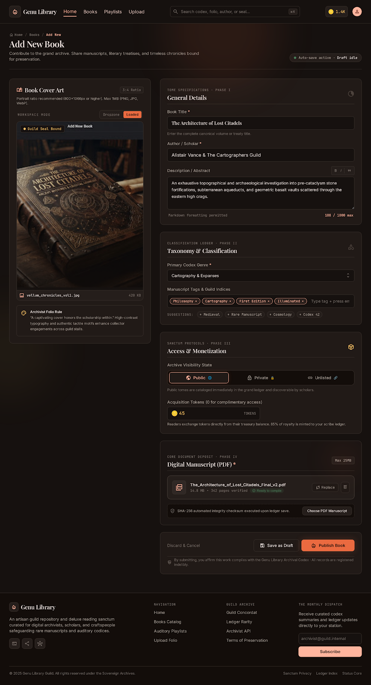
</p>

Four-phase book creation form: metadata, tags, visibility/pricing, and file uploads (cover + PDF manuscript).

---

#### Edit Book

<p align="center">
  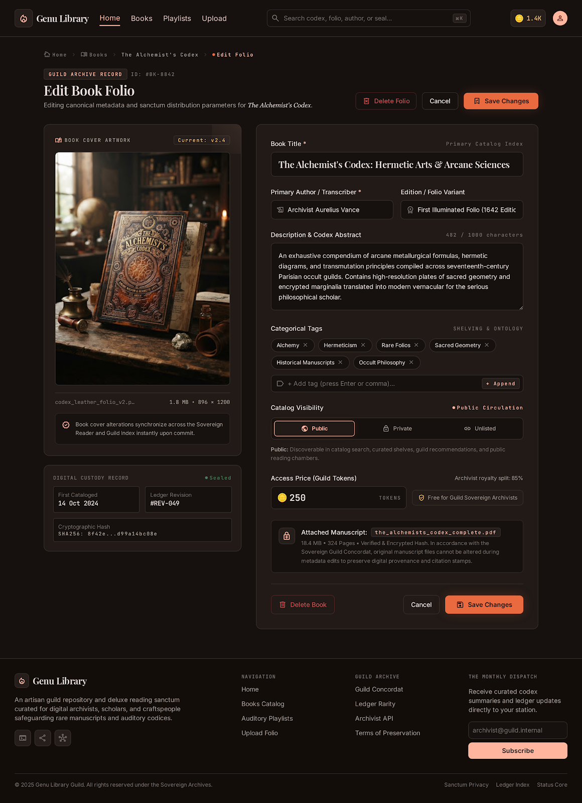
</p>

Edit existing book metadata with dirty-state tracking and a digital custody record display.

---

#### Delete Book Confirmation

<p align="center">
  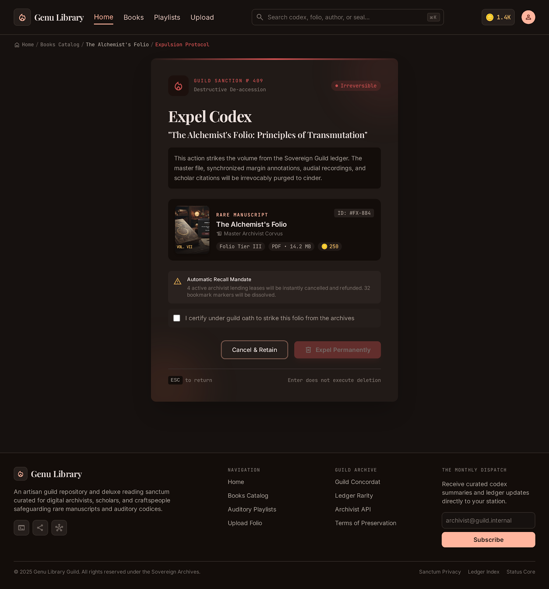
</p>

Danger-themed confirmation page with book preview and guild oath certification checkbox.

---

#### Master Archivist Profile

<p align="center">
  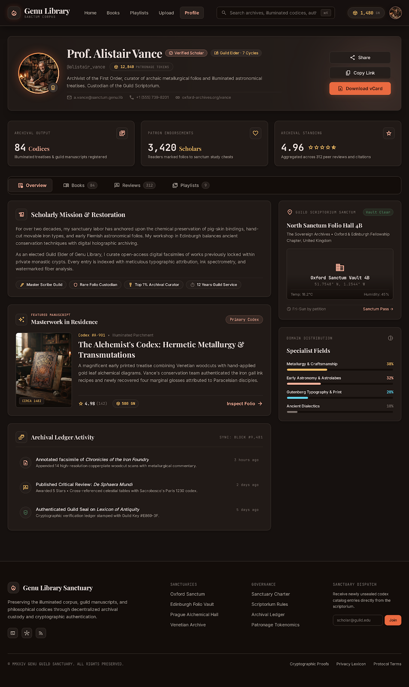
</p>

User profile with avatar, stats (uploads, favorites, avg rating), tabs for overview/books/reviews/playlists, and social actions.

---

#### Edit Profile

<p align="center">
  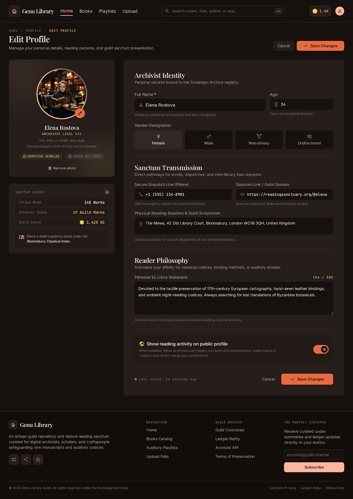
</p>

Profile editing with avatar upload, sanctum ledger stats, and form fields for personal information.

---

#### Edit Playlist

<p align="center">
  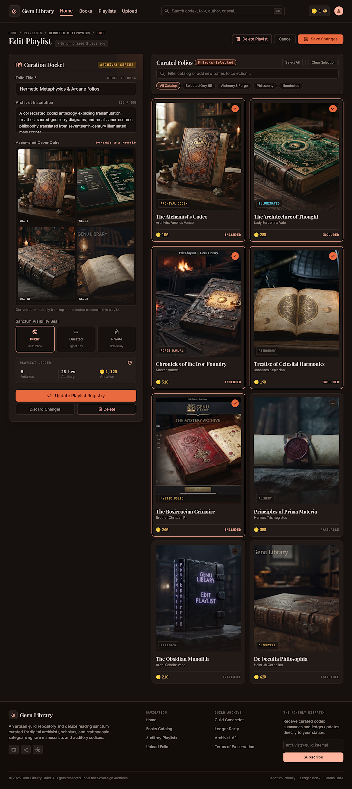
</p>

Playlist editing with title, description, and visibility settings.

---

#### Bulk Book Upload

<p align="center">
  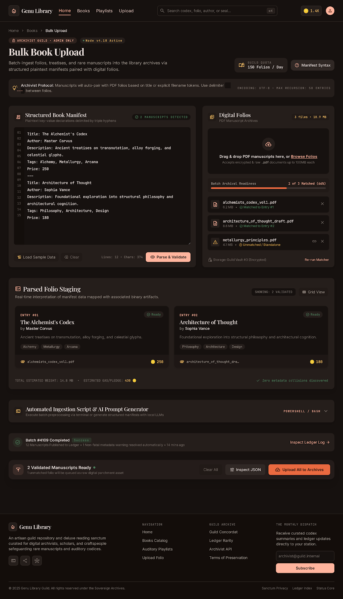
</p>

Admin tool with plaintext manifest editor, drag-and-drop PDF uploader, parsed staging table, and PowerShell script generator.

---

#### Book Cover Art

<p align="center">
  
</p>

Example of the ornate, antique book cover aesthetic used throughout the platform.

---

### Tablet Views

<p align="center">
  
  &nbsp;&nbsp;
  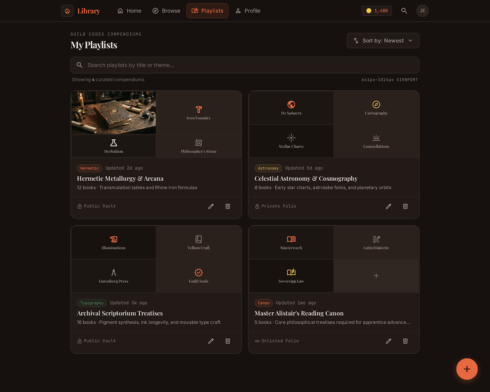
</p>

<p align="center">
  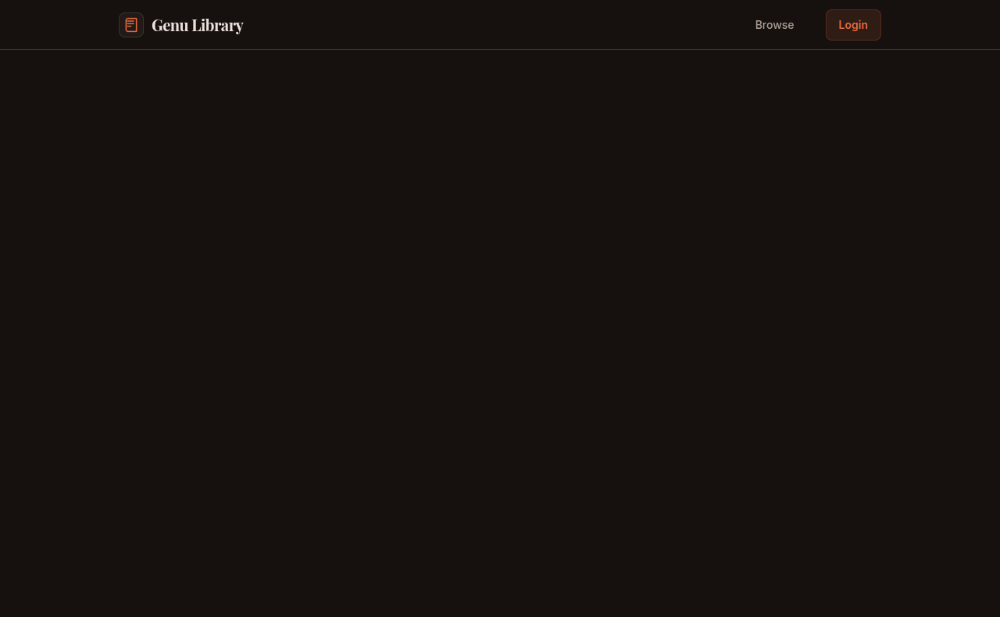
  &nbsp;&nbsp;
  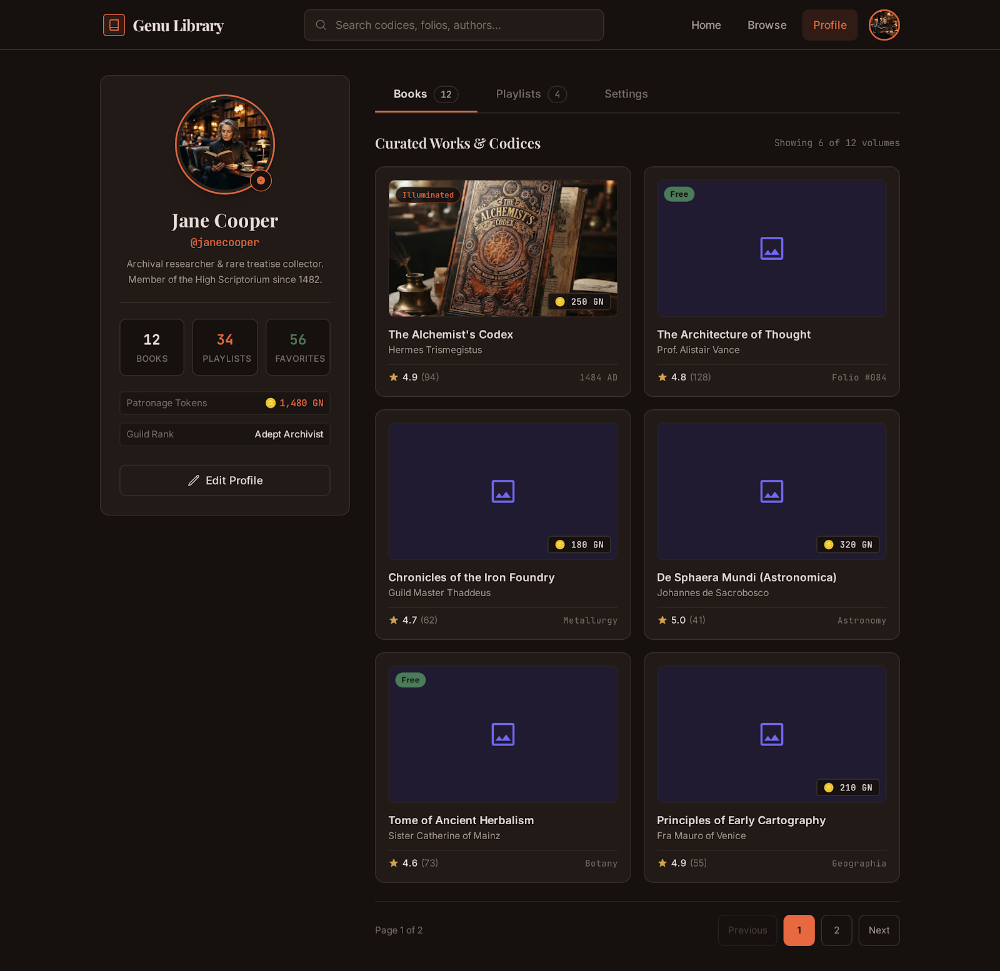
</p>

### Mobile Views

<p align="center">
  
  &nbsp;
  
  &nbsp;
  
  &nbsp;
  
</p>

<p align="center">
  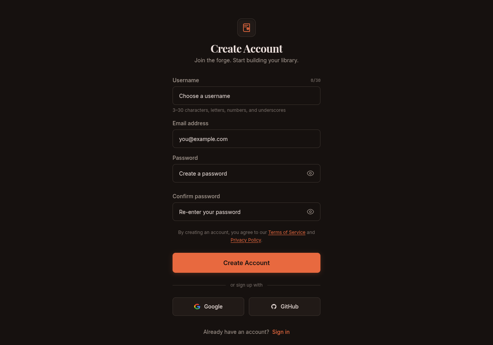
  &nbsp;
  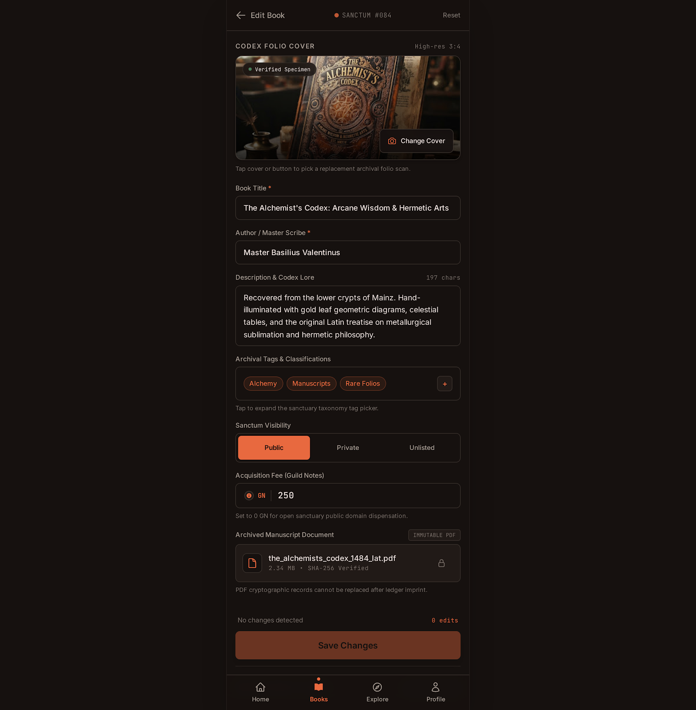
  &nbsp;
  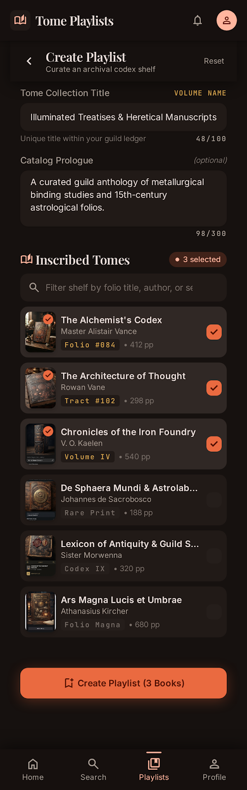
  &nbsp;
  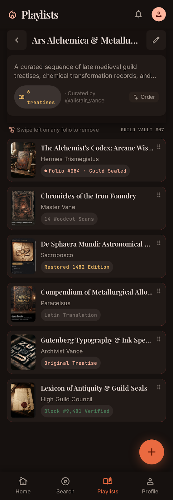
</p>

---

## 7. Every Page -- What It Does

### `/` -- Homepage (`app/page.tsx`, 397 lines)

**Type**: Server Component

Fetches data from `books.home()` which returns featured books, recent books, trending tags, and platform stats (total books, users, reviews).

**Sections rendered:**
1. **Hero section** -- Large heading "The Guild's Living Archive", search bar, trending tag pills
2. **Stats bar** -- Three counters: total books, total users, total reviews
3. **Featured carousel** -- Horizontal auto-scrolling carousel of 4 featured books (via `FeaturedCarousel` component)
4. **Recently Added** -- Grid of 6 most recent books
5. **CTA section** -- "Contribute to the Guild" call-to-action with upload link

**Fallback**: If the API is unreachable, renders hardcoded placeholder data (3 featured books, 3 recent books).

---

### `/login` -- Login (`app/(auth)/login/page.tsx`, 332 lines)

**Type**: Client Component

Two-panel layout: left panel shows atmospheric image with quote; right panel has the login form.

**Form fields:**
- Email (validated: must be valid email format)
- Password (validated: minimum 6 characters)
- Show/hide password toggle
- Remember me checkbox (not wired to anything)
- Forgot password link (goes to `/forgot-password`)

**On submit**: Calls `auth.login(email, password)`. On success, stores JWT tokens in localStorage and redirects to `/`. On failure, shows toast error.

**Social login buttons**: Google and GitHub buttons are rendered but **not functional** (no OAuth configured).

---

### `/register` -- Registration (`app/(auth)/register/page.tsx`, 485 lines)

**Type**: Client Component

Same two-panel layout as login.

**Form fields:**
- Username (3-20 chars, alphanumeric + underscore only, validated in real-time)
- Email
- Password (with strength meter: Weak/Fair/Good/Strong based on length, uppercase, lowercase, numbers, special chars)
- Confirm password (real-time match indicator with checkmark/X)
- Terms checkbox (must be checked)

**On submit**: Calls `auth.register(email, password, confirmPassword)`. On success, stores JWT tokens and redirects to `/`.

---

### `/forgot-password` -- Forgot Password (`app/(auth)/forgot-password/page.tsx`, 120 lines)

**Type**: Client Component

Single email input. **This is a placeholder** -- there is no backend endpoint for password reset. The form uses `setTimeout` to simulate sending an email, then shows a "Check Your Email" success state.

---

### `/books` -- Book Catalog (`app/books/page.tsx` + `BookListClient.tsx`, 500 lines total)

**Type**: Server Component (`page.tsx`) fetches data, passes to Client Component (`BookListClient.tsx`)

**Features:**
- **Search**: Real-time search across title, author, tag names, uploader username
- **Tag filtering**: Click one of 9 predefined tags (Sacred Math, Alchemy & Art, Craftsmanship, Astronomy, Metallurgy, Linguistics, Printmaking, Ancient History, Typography)
- **Sorting**: Newest, Title A-Z, Most Popular (by favorites), Highest Rated, Price Low-High
- **Pagination**: 12 books per page, with numbered page buttons
- **Book cards**: Cover image, favorite toggle (heart icon), star rating, price badge, uploader name

**Data normalization**: The component handles both object and string formats for `uploader` and `tag` fields (the API returns objects, but the component defensively handles strings too).

---

### `/books/[slug]` -- Book Detail (`app/books/[slug]/BookDetailClient.tsx`, 572 lines)

**Type**: Client Component (the largest file in the app)

**Sections:**
1. **Hero section** -- Book cover image, tag badge, "Public" badge, title, author, uploader info with guild rank, price in tokens
2. **Action buttons** -- "Read Codex" (opens PDF viewer), "Favorite" (toggle), "Share" (Web Share API)
3. **PDF viewer** -- Dynamically imported `PdfViewer` component (loaded only when needed, no SSR)
4. **Description** -- Expand/collapse with "Show More"/"Show Less"
5. **Reviews section** -- Interactive 5-star rating (with descriptions: 1=Poor, 2=Fair, 3=Good, 4=Very Good, 5=Masterpiece), rating distribution bars, comments list, add comment form
6. **Related books** -- Hardcoded 4-book recommendation grid

**API calls:**
- `books.favorite(slug)` -- toggle favorite
- `books.rate(slug, rating)` -- submit/update rating
- `books.comment(slug, { comment })` -- post comment

---

### `/books/[slug]/edit` -- Edit Book (`app/books/[slug]/edit/page.tsx`, 513 lines)

**Type**: Client Component

Loads existing book data on mount via `books.detail(slug)`. Form fields: title, author, description (with markdown toolbar), tags (add/remove chips), visibility (public/private/unlisted with descriptions), price, cover image (replace).

**Dirty-state tracking**: Save button is disabled until a field changes.

**On submit**: Submits `FormData` to `books.update(slug, formData)`. Shows digital custody record with hardcoded dates and hash.

---

### `/books/[slug]/delete` -- Delete Book (`app/books/[slug]/delete/page.tsx`, 220 lines)

**Type**: Client Component

Danger-themed confirmation page. Shows book preview card (cover, title, author, tags, price). Requires checkbox acknowledgment ("I certify under guild oath"). Supports Escape key to go back.

**On confirm**: Calls `books.delete(slug)`, redirects to `/books`.

---

### `/books/new` -- Create Book (`app/books/new/page.tsx`, 518 lines)

**Type**: Client Component

Four-phase form:
- **Phase I**: Title, author, description (with markdown formatting toolbar)
- **Phase II**: Tag management with chips, Enter/comma to add, suggested tags
- **Phase III**: Visibility (public/private/unlisted), price in tokens
- **Phase IV**: Cover image upload (PNG/JPG/WebP, max 1MB) with drag-drop, PDF manuscript upload (max 25MB) with drag-drop

**On submit**: Submits `FormData` to `books.create(formData)`, redirects to the new book's page.

---

### `/upload` -- Simple Upload (`app/upload/page.tsx`, 325 lines)

**Type**: Client Component

Simpler alternative to `/books/new`. Single-form layout with: title, author, description, price, visibility, tags, cover image, PDF file. Uses `useToast` for notifications.

---

### `/playlists` -- Playlist Catalog (`app/playlists/page.tsx` + `PlaylistListClient.tsx`, 258 lines total)

**Type**: Server Component fetches, Client Component renders

Features: search, sorting (newest, title A-Z, most books), card grid with cover image, book count badge, title, description, creator name, relative creation time.

---

### `/playlists/[slug]` -- Playlist Detail (`app/playlists/[slug]/PlaylistDetailClient.tsx`, 232 lines)

**Type**: Client Component

Hero section with cover, badge, stats (book count, avg rating, creation date), title, description, creator info. Book list as card grid (each links to book detail).

---

### `/playlists/[slug]/edit` -- Edit Playlist (`app/playlists/[slug]/edit/page.tsx`, 252 lines)

**Type**: Client Component

Loads existing playlist, form with title, description, visibility. Dirty-state tracking. Submits via `books.playlistUpdate()`.

---

### `/playlists/new` -- Create Playlist (`app/playlists/new/page.tsx`, 191 lines)

**Type**: Client Component

Fields: title (required), description (1000 chars, markdown permitted), visibility (public/private/unlisted radio buttons).

---

### `/bulk-upload` -- Bulk Book Upload (`app/bulk-upload/page.tsx`, 565 lines)

**Type**: Client Component

Admin tool. Left panel: plaintext manifest editor with line numbers, sample data loader, parse/validate button. Right panel: drag-and-drop PDF file uploader. Below: parsed staging table showing matched books. Includes PowerShell script generator and manifest syntax guide modal.

---

### `/bulk-upload/tags` -- Bulk Tag Upload (`app/bulk-upload/tags/page.tsx`, 467 lines)

**Type**: Client Component

Admin tool. Left panel: textarea for comma/newline-separated tags with auto-normalization. Right panel: existing taxonomy directory with search/sort. Features: new vs existing tag detection, auto-binding, deduplication, CSV export.

---

### `/tags/new` -- Create Tag (`app/tags/new/page.tsx`, 392 lines)

**Type**: Client Component

Tag name input with real-time duplicate detection, 5 category quick-stamp buttons, optional annotation. Right panel: existing tag list with search/sort.

---

### `/profile/[username]` -- User Profile (`app/profile/[username]/ProfileClient.tsx`, 393 lines)

**Type**: Client Component

Hero section with avatar (gradient border, verified badge), full name, username, token balance, bio, contact info. Three stat cards (uploads, favorites, avg rating). Four tabs: Overview, Books (placeholder), Reviews (placeholder), Playlists (placeholder). Share, copy link, vCard download.

---

### `/profile/edit` -- Edit Profile (`app/profile/edit/ProfileEditClient.tsx`, 425 lines)

**Type**: Client Component

Left sidebar: avatar upload, sanctum ledger stats. Main form: full name, age, gender (radio group), phone, social link, address, bio (300 char limit with color indicator). Submits via `FormData`.

---

### `/reports/new` -- Report Book (`app/reports/new/page.tsx`, 337 lines)

**Type**: Client Component

Four violation categories (copyright, adult, spam, other) with radio selection. Optional description textarea. Guild integrity warning. Submits report via API.

---

## 8. Every Component -- What It Does

### `Header` (`components/Header.tsx`, 195 lines)

**Type**: Client Component

The top navigation bar, fixed to the top of the viewport. Two variants:

1. **Desktop** (visible on `md:` breakpoint and above): Horizontal bar with logo ("Genu Library" text), nav links (Home, Books, Lists, Upload), search input with `Cmd+K` hint, token badge (hardcoded "1.4K"), and user avatar or login button.

2. **Mobile** (visible below `md:` breakpoint): Fixed bottom bar with 4 icon-only nav links (Home, Books, Lists, Upload).

**Auth-aware**: Uses `auth.isLoggedIn()` to conditionally render avatar or login link. Uses a `mounted` state flag to avoid hydration mismatch (renders skeleton on first pass, real content after mount).

---

### `Footer` (`components/Footer.tsx`, 100 lines)

**Type**: Server Component compatible (no `"use client"`)

Five-column responsive grid:
1. Brand + tagline + social icons (GitHub, Twitter, Discord -- all `#` links)
2. Navigation links (Home, Books Catalog, Playlists, Upload Folio)
3. Guild Archive links (placeholder `#` hrefs)
4. Newsletter signup form (email input + Subscribe button -- not wired)
5. Bottom bar with copyright + legal links (Terms, Privacy, Cookies)

---

### `Toast` (`components/Toast.tsx`, 94 lines)

**Type**: Client Component

A React Context-based toast notification system.

**API**: `toast(message, type?)` where `type` is `'success'` | `'error'` | `'info'`.

**Behavior:**
- Maximum 3 toasts visible at once (oldest removed when exceeded)
- Auto-dismiss after 3 seconds
- Click to dismiss manually
- Fixed position at `top-16` (below header)
- Each type has a distinct Material icon, border color, and text color

**Exports:**
- `ToastProvider` -- wraps the app in `layout.tsx`, provides context + renders toast container
- `useToast()` -- hook returning `{ toast }`

---

### `FeaturedCarousel` (`app/FeaturedCarousel.tsx`, 176 lines)

**Type**: Client Component

Horizontal auto-scrolling carousel for featured books on the homepage.

**Features:**
- Scroll-snap alignment
- Autoplay every 3.5 seconds (pauses on hover)
- Prev/next arrow buttons
- Dot pagination
- Local favorite toggle per card (not persisted)
- Responsive: 1 card mobile, 2 tablet, 4 desktop

---

### `PdfViewer` (`app/books/[slug]/PdfViewer.tsx`, 203 lines)

**Type**: Client Component (dynamically imported, no SSR)

A mock "Illuminated Codex Reader" -- does **not** render actual PDF content. Shows placeholder Latin text with:
- Page navigation (input field + prev/next buttons)
- Zoom controls (75-175% in 15% steps, fit-to-width)
- Keyboard shortcuts (arrow keys for page flip)
- Fullscreen toggle
- Download link

> This is a UI placeholder. Real PDF rendering would require a library like `react-pdf` or `pdf.js`.

---

## 9. API Client Layer

The entire backend communication lives in `lib/api.ts` (124 lines). It provides:

### Core Functions

```typescript
apiFetch(path: string, options?: RequestInit): Promise<Response>
```
- Prepends `NEXT_PUBLIC_API_BASE_URL` (default `http://localhost:8080`) to the path
- Adds `Authorization: Bearer <access_token>` header if tokens exist in localStorage
- On 401 response: automatically refreshes the access token using the refresh token, then retries the original request
- On refresh failure: clears tokens and returns the 401 response

```typescript
apiJson<T>(path: string, options?: RequestInit): Promise<T>
```
- Wraps `apiFetch`, parses JSON, throws on non-OK status

```typescript
mediaUrl(path: string | null | undefined): string
```
- Converts relative media paths (e.g., `/media/cover_pages/book.jpg`) to full URLs (`http://localhost:8080/media/cover_pages/book.jpg`)
- Returns `/placeholder-book.svg` for null/undefined/empty paths

### Auth Module

| Method | Endpoint | Purpose |
|--------|----------|---------|
| `auth.login(email, password)` | `POST /v1/api/users/login/` | Authenticate, return JWT tokens |
| `auth.register(email, pw, pw2)` | `POST /v1/api/users/register/` | Create account, return JWT tokens |
| `auth.logout()` | -- | Clear tokens from localStorage |
| `auth.isLoggedIn()` | -- | Check if access token exists |

### Books Module

| Method | Endpoint | Purpose |
|--------|----------|---------|
| `books.list()` | `GET /v1/api/books/` | List all books |
| `books.detail(slug)` | `GET /v1/api/books/{slug}/` | Get book by slug |
| `books.create(formData)` | `POST /v1/api/books/add/` | Create book (multipart) |
| `books.update(slug, fd)` | `PUT/PATCH /v1/api/books/{slug}/edit/` | Update book |
| `books.delete(slug)` | `DELETE /v1/api/books/{slug}/delete/` | Delete book |
| `books.favorite(slug)` | `POST /v1/api/books/{slug}/favorite/` | Toggle favorite |
| `books.rate(slug, rating)` | `POST /v1/api/books/{slug}/rate/` | Rate book (1-5) |
| `books.comment(slug, data)` | `POST /v1/api/books/{slug}/comment/` | Post comment |
| `books.report(slug, data)` | `POST /v1/api/books/{slug}/report/` | Report violation |
| `books.addToPlaylist(slug, pid)` | `POST /v1/api/books/{slug}/add_to_playlist/` | Add to playlist |
| `books.suggestions(q)` | `GET /v1/api/books/suggestions/?q=` | Search suggestions |
| `books.home()` | `GET /v1/api/books/home/` | Homepage data |
| `books.featured()` | `GET /v1/api/books/featured/` | Featured books |
| `books.bulkUpload(fd)` | `POST /v1/api/books/bulk-upload/` | Bulk upload |
| `books.bulkTagUpload(fd)` | `POST /v1/api/books/bulk-tag-upload/` | Bulk tag upload |
| `books.addTag(data)` | `POST /v1/api/books/tag/add/` | Create tag |
| `books.playlists()` | `GET /v1/api/books/playlists/` | List playlists |
| `books.playlistDetail(slug)` | `GET /v1/api/books/playlists/{slug}/` | Playlist detail |
| `books.playlistCreate(data)` | `POST /v1/api/books/playlists/add/` | Create playlist |
| `books.playlistUpdate(slug, d)` | `PUT/PATCH /v1/api/books/playlists/{slug}/edit/` | Update playlist |

### Profile Module

| Method | Endpoint | Purpose |
|--------|----------|---------|
| `profile.list()` | `GET /v1/api/profile/list` | List all profiles |
| `profile.me()` | `GET /v1/api/profile/me/` | Get own profile |
| `profile.update(fd)` | `PUT/PATCH /v1/api/profile/me/` | Update own profile |
| `profile.detail(username)` | `GET /v1/api/profile/{username}/` | Get profile by username |

---

## 10. Data Flow -- How a Request Travels

### Example: User Logs In

```
1. User types email + password into login form
2. Form validates: email format, password >= 6 chars
3. On submit: calls auth.login(email, password)
4. auth.login() calls apiJson('/v1/api/users/login/', {
     method: 'POST',
     headers: { 'Content-Type': 'application/json' },
     body: JSON.stringify({ email, password })
   })
5. apiJson() calls apiFetch() which:
   a. Prepends base URL: http://localhost:8080/v1/api/users/login/
   b. No auth header (no tokens yet)
   c. Sends fetch() request
6. Backend validates credentials, returns { refresh, access }
7. apiJson() parses JSON, returns { refresh, access }
8. auth.login() calls setTokens(access, refresh) which stores in localStorage:
   - localStorage.setItem('access_token', access)
   - localStorage.setItem('refresh_token', refresh)
9. Router pushes to '/' (homepage)
10. Header component detects isLoggedIn() === true, shows avatar
```

### Example: User Favors a Book

```
1. User clicks heart icon on a book card
2. BookCard calls books.favorite(slug)
3. books.favorite() calls apiFetch('/v1/api/books/{slug}/favorite/', {
     method: 'POST'
   })
4. apiFetch() adds Authorization header with stored access token
5. Sends request to backend
6. Backend: get_or_create BookFavorite; if exists, delete (toggle off)
7. Returns { is_favorited: true/false, total_favorites: N }
8. BookCard updates local state: isFavorited, favoriteCount
9. Heart icon toggles between outline (not favorited) and filled (favorited)
```

### Example: Token Auto-Refresh on 401

```
1. Any API call returns 401 (access token expired)
2. apiFetch() intercepts the 401
3. Reads refresh token from localStorage
4. Sends POST to /v1/api/users/get/access-token/ with { refresh }
5. If refresh is valid: backend returns new { access }
6. apiFetch() updates localStorage with new access token
7. Retries the original request with the new token
8. If refresh is invalid: clears all tokens, returns 401 to caller
9. User appears logged out, Header shows login button
```

---

## 11. Authentication System

### Token Storage

| Token | localStorage Key | Lifetime |
|-------|-----------------|----------|
| Access Token | `access_token` | 30 days (backend setting) |
| Refresh Token | `refresh_token` | 60 days (backend setting) |

### Auth Flow

```
Registration:
  POST /v1/api/users/register/ { email, password, password2 }
  -> Returns { user: { username, email }, refresh, access }
  -> Tokens stored in localStorage

Login:
  POST /v1/api/users/login/ { email, password }
  -> Returns { refresh, access }
  -> Tokens stored in localStorage

Logout:
  -> Clears localStorage tokens
  -> Redirects to /

Token Refresh (automatic):
  On any 401 response, apiFetch() intercepts and:
  1. POST /v1/api/users/get/access-token/ { refresh }
  2. Updates access_token in localStorage
  3. Retries original request
```

### What's Protected

- **Public pages**: Homepage, book catalog, book detail, playlists, profiles, search
- **Authenticated pages**: Upload, create/edit/delete books, playlists, profile edit, reports, favorites, ratings, comments
- **No middleware protection**: Auth checks are done client-side. There is no Next.js middleware redirecting unauthenticated users. If a user navigates directly to `/upload` without logging in, the page loads but API calls will fail with 401.

---

## 12. Routing Map

| URL | File | Type | Auth Required |
|-----|------|------|---------------|
| `/` | `app/page.tsx` | Server | No |
| `/login` | `app/(auth)/login/page.tsx` | Client | No |
| `/register` | `app/(auth)/register/page.tsx` | Client | No |
| `/forgot-password` | `app/(auth)/forgot-password/page.tsx` | Client | No |
| `/books` | `app/books/page.tsx` | Server | No |
| `/books/[slug]` | `app/books/[slug]/page.tsx` | Server | No |
| `/books/[slug]/edit` | `app/books/[slug]/edit/page.tsx` | Client | Yes |
| `/books/[slug]/delete` | `app/books/[slug]/delete/page.tsx` | Client | Yes |
| `/books/new` | `app/books/new/page.tsx` | Client | Yes |
| `/upload` | `app/upload/page.tsx` | Client | Yes |
| `/playlists` | `app/playlists/page.tsx` | Server | No |
| `/playlists/[slug]` | `app/playlists/[slug]/page.tsx` | Server | No |
| `/playlists/[slug]/edit` | `app/playlists/[slug]/edit/page.tsx` | Client | Yes |
| `/playlists/new` | `app/playlists/new/page.tsx` | Client | Yes |
| `/bulk-upload` | `app/bulk-upload/page.tsx` | Client | Yes |
| `/bulk-upload/tags` | `app/bulk-upload/tags/page.tsx` | Client | Yes |
| `/tags/new` | `app/tags/new/page.tsx` | Client | Yes |
| `/profile/[username]` | `app/profile/[username]/page.tsx` | Server | No |
| `/profile/edit` | `app/profile/edit/page.tsx` | Server | Yes |
| `/reports/new` | `app/reports/new/page.tsx` | Client | Yes |

**Total: 20 routes**

---

## 13. Configuration Files

### `package.json`

- **Name**: `genu-library-frontend`
- **Version**: 0.1.0
- **Scripts**:
  - `dev` -- `next dev` (development server with hot reload)
  - `build` -- `next build` (production build)
  - `start` -- `next start` (serve production build)
  - `lint` -- `next lint`
  - `typecheck` -- `tsc --noEmit`

### `next.config.mjs`

- `output: 'standalone'` -- Enables self-contained builds for Docker (no node_modules needed at runtime)
- `images.remotePatterns` -- Allows images from `lh3.googleusercontent.com` (Google avatars) and `localhost:8080` (backend media)

### `tailwind.config.ts`

116 lines defining the complete design system. See [Section 5: Design System](#5-design-system).

### `tsconfig.json`

- Target: ES5
- Module: Bundler
- Strict mode enabled
- Path alias: `@/*` maps to project root (e.g., `@/lib/api` resolves to `lib/api.ts`)

### `.env.local`

```
NEXT_PUBLIC_API_BASE_URL=http://localhost:8080
```

The `NEXT_PUBLIC_` prefix makes this available to both server and client code. In Docker, this is overridden by the build arg `NEXT_PUBLIC_API_BASE_URL=http://backend:8080`.

---

## 14. Docker

### Dockerfile (Multi-Stage Build)

**Stage 1 -- Build** (`node:20-alpine`):
1. Copy `package.json` and install dependencies
2. Copy source code and run `npm run build`
3. Next.js produces a `.next/standalone` directory (self-contained Node.js server)

**Stage 2 -- Run** (`node:20-alpine`):
1. Copy `.next/standalone` from build stage
2. Copy `.next/static` (CSS, JS bundles) into `.next/static`
3. Create `public/` directory
4. Expose port 3001
5. Run `node server.js`

### How to Run

```bash
# Build and start with Docker Compose (from project root)
docker compose build frontend
docker compose up -d frontend

# Or standalone
docker build -t library-frontend ./Library-frontend
docker run -p 3001:3001 -e NEXT_PUBLIC_API_BASE_URL=http://backend:8080 library-frontend
```

The frontend depends on the backend being available at the URL specified by `NEXT_PUBLIC_API_BASE_URL`.

---

## 15. Local Development Setup

### Prerequisites

- Node.js 20+
- npm
- Backend API running at `http://localhost:8080` (or set `NEXT_PUBLIC_API_BASE_URL` in `.env.local`)

### Steps

```bash
cd Library-frontend

# Install dependencies
npm install

# Start development server (with hot reload)
npm run dev

# The app is now at http://localhost:3001
```

### Available Commands

| Command | Purpose |
|---------|---------|
| `npm run dev` | Start dev server at localhost:3001 |
| `npm run build` | Production build (validates types + lint) |
| `npm run start` | Serve production build |
| `npm run lint` | Run ESLint |
| `npm run typecheck` | Run TypeScript compiler (no emit) |

---

## 16. Known Limitations & TODOs

### Not Implemented

- **Forgot Password**: The page exists but the backend has no password reset endpoint. It uses a `setTimeout` placeholder.
- **Social Login**: Google and GitHub buttons render but are not wired to any OAuth flow.
- **PDF Rendering**: The PDF viewer is a mock UI with placeholder text. Real PDF rendering would require `react-pdf` or `pdf.js`.
- **Search (Cmd+K)**: The search bar in the Header has a `Cmd+K` hint but no keyboard shortcut or search modal is implemented.
- **Newsletter Signup**: The footer has a newsletter form but no backend to subscribe.
- **Profile Tabs**: Books, Reviews, and Playlists tabs on the profile page show placeholder content.
- **Report Attachments**: The report page has a file attachment UI that is not wired.
- **Remember Me**: The checkbox on login does not persist across sessions beyond the JWT lifetime.

### Data Handling

- **No global state**: All state is component-local. If a user favorites a book on the catalog page, the detail page won't know until it re-fetches.
- **No optimistic updates**: Favoriting and rating wait for the API response before updating the UI.
- **No loading skeletons**: Most pages show nothing or a simple spinner while data loads.
- **No error boundaries**: If a component throws during rendering, the entire page crashes with no recovery.
- **Hardcoded data**: Several places use hardcoded arrays instead of API data (tag filters, related books on detail page, comments on detail page, profile stats).

### Security

- **No middleware auth guard**: Unauthenticated users can access protected pages; they'll just get 401 errors on API calls.
- **JWT in localStorage**: Vulnerable to XSS attacks. HttpOnly cookies would be more secure.
- **No CSRF protection**: API calls use Bearer tokens, which provides some protection, but no explicit CSRF token flow exists.

### Performance

- **No image optimization**: Book cover images use standard `` tags, not Next.js `<Image>` component.
- **No code splitting beyond dynamic imports**: Only `PdfViewer` uses dynamic import. All other pages load their full JavaScript bundle.
- **No service worker or offline support**.

---

## UI Design Reference

The `docs/ui/` directory contains high-fidelity UI screenshots and HTML prototypes organized by device class:

| Directory | Contents |
|-----------|----------|
| `docs/ui/desktop/p1/` | Desktop designs (Phase 1) -- 14 screens with HTML prototypes |
| `docs/ui/desktop/p2/` | Desktop designs (Phase 2) -- 7 screens with HTML prototypes |
| `docs/ui/tablet/` | Tablet layouts -- 13 screens across 2 device sets |
| `docs/ui/mobile/` | Mobile layouts -- 17 screens across 2 device sets |
| `docs/prompt/` | Design prompt specifications for each page (desktop, mobile, tablet) |

Each screen directory contains:
- `screen.png` -- The rendered UI screenshot
- `code.html` -- The HTML/CSS prototype source code
