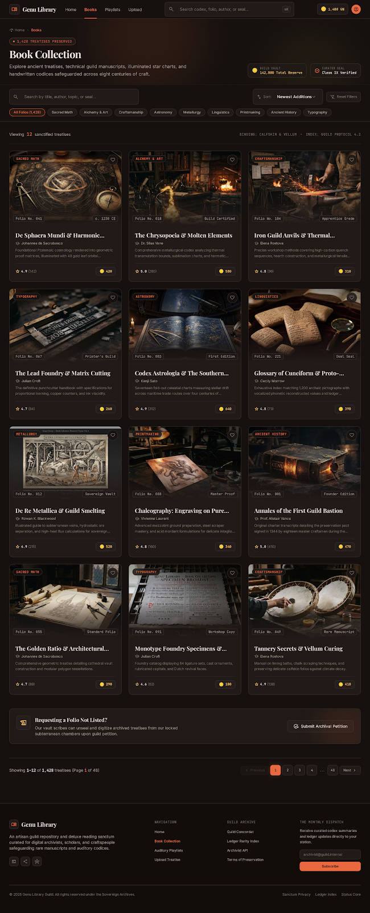
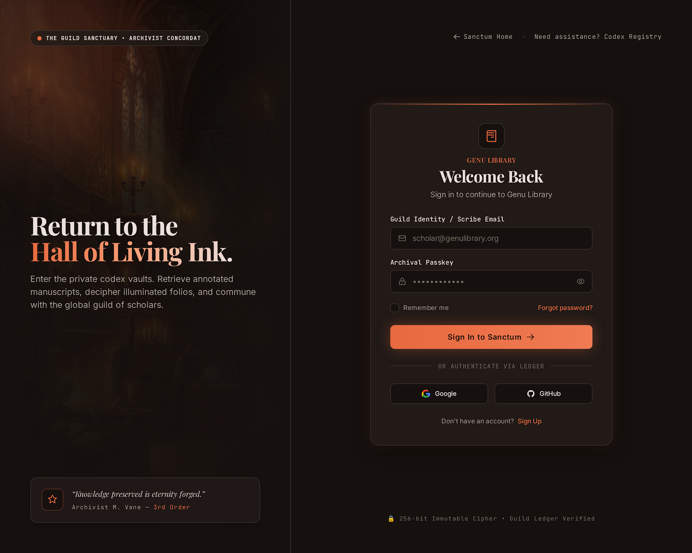
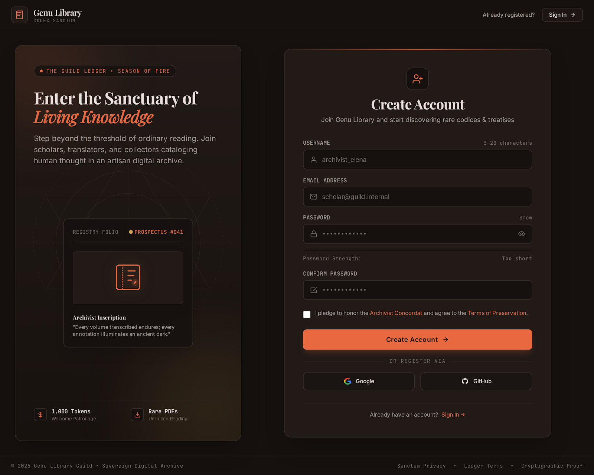
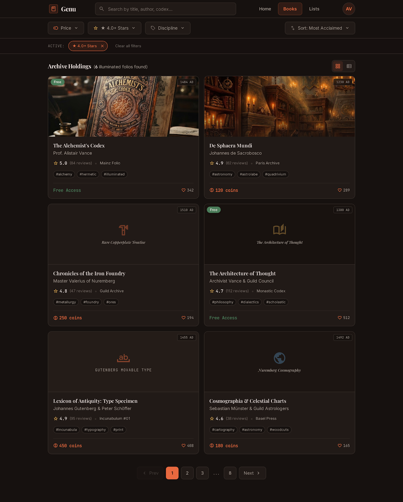
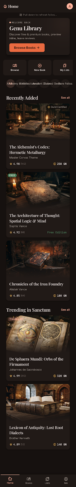
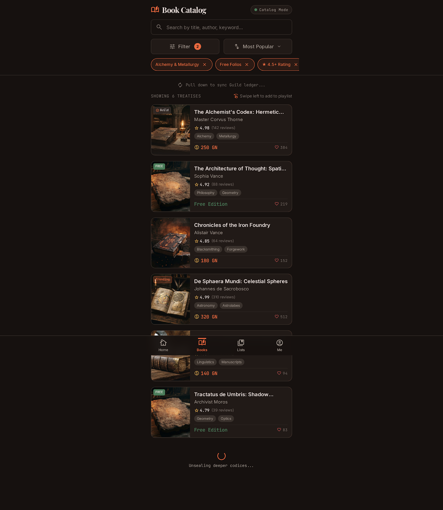
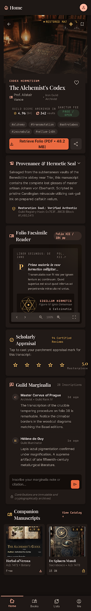
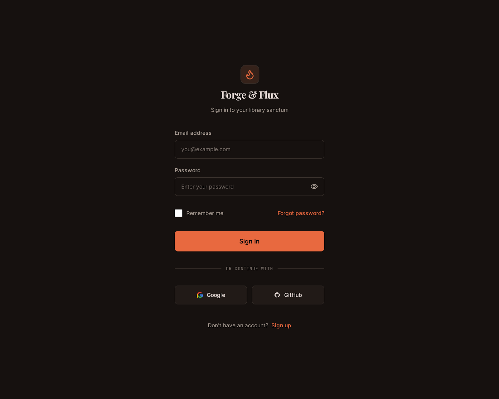

# Genu Library -- Frontend


<p align="center">
  
</p>

Fantasy-themed digital library platform with a "Forge & Guild" aesthetic — warm browns, amber accents, parchment textures. Next.js 14 App Router frontend talking to a Django REST Framework backend.

---

## Table of Contents

1. [Tech Stack](#1-tech-stack)
2. [Architecture](#2-architecture)
3. [Project Structure](#3-project-structure)
4. [Design System](#4-design-system)
5. [UI Showcase](#5-ui-showcase)
6. [Pages & Components](#6-pages--components)
7. [API Client](#7-api-client)
8. [Auth System](#8-auth-system)
9. [Routing](#9-routing)
10. [Docker & Setup](#10-docker--setup)
11. [Known Limitations](#11-known-limitations)

---

## 1. Tech Stack

| Layer | Tech | Purpose |
|-------|------|---------|
| Framework | Next.js 14.2.22 | App Router, SSR, standalone output |
| UI | React 18.3.x | Component rendering, hooks |
| Language | TypeScript 5.6 | Type safety |
| Styling | Tailwind CSS 3.4.16 | Utility-first CSS |
| Fonts | Inter, Playfair Display, JetBrains Mono | Body, display, code |
| Icons | Material Symbols (outlined) | Variable font icons |
| Backend | Django DRF | Separate service at port 8080 |

No state management library — all state is component-local (`useState`/`useCallback`/`useMemo`). No data fetching library — raw `fetch` via custom API client.

---

## 2. Architecture

```
User's Browser
     |
     | HTTP (REST)
     v
+------------------+          +-------------------+
|  Next.js App     |  ----->  |  Django REST API   |
|  (port 3001)     |  fetch   |  (port 8080)       |
|  Tailored UI     |  <-----  |  JSON responses    |
+------------------+          +-------------------+
                                      |
                                      v
                               +-------------------+
                               |  SQLite Database   |
                               +-------------------+
```

**Rendering strategy**: Server Components (`page.tsx`) fetch data from backend. Client Components (`"use client"`) handle all interaction — forms, modals, carousels, search, rating.

---

## 3. Project Structure

```
Library-frontend/
|-- app/                          # Next.js App Router pages
|   |-- layout.tsx                # Root layout (fonts, metadata, ToastProvider)
|   |-- page.tsx                  # Homepage (hero, featured, recent, stats)
|   |-- globals.css               # Tailwind directives + base styles
|   |-- FeaturedCarousel.tsx      # Horizontal auto-scrolling carousel
|   |-- (auth)/                   # Auth route group
|   |   |-- login/page.tsx        # Login form
|   |   |-- register/page.tsx     # Registration form
|   |   |-- forgot-password/page.tsx
|   |-- books/
|   |   |-- page.tsx              # Book catalog (server fetch)
|   |   |-- BookListClient.tsx    # Search, filter, sort, paginate
|   |   |-- new/page.tsx          # Create book (4-phase form)
|   |   |-- [slug]/
|   |       |-- page.tsx          # Book detail
|   |       |-- BookDetailClient.tsx  # PDF, rating, comments
|   |       |-- PdfViewer.tsx     # Mock PDF reader
|   |       |-- edit/page.tsx     # Edit book
|   |       |-- delete/page.tsx   # Delete confirmation
|   |-- playlists/
|   |   |-- page.tsx              # Playlist catalog
|   |   |-- PlaylistListClient.tsx
|   |   |-- new/page.tsx
|   |   |-- [slug]/
|   |       |-- page.tsx
|   |       |-- PlaylistDetailClient.tsx
|   |       |-- edit/page.tsx
|   |-- upload/page.tsx           # Single-book upload
|   |-- bulk-upload/
|   |   |-- page.tsx              # Bulk book upload
|   |   |-- tags/page.tsx         # Bulk tag upload
|   |-- tags/new/page.tsx         # Create tag
|   |-- profile/
|   |   |-- [username]/page.tsx   # View profile
|   |   |-- [username]/ProfileClient.tsx
|   |   |-- edit/page.tsx
|   |   |-- edit/ProfileEditClient.tsx
|   |-- reports/new/page.tsx      # Report book
|
|-- components/
|   |-- Header.tsx                # Top nav + mobile bottom nav
|   |-- Footer.tsx                # 5-column footer
|   |-- Toast.tsx                 # Toast notification system
|
|-- lib/
|   |-- api.ts                    # API client (JWT auth, all endpoints)
|   |-- formatTokens.ts           # Number abbreviation + relative time
|
|-- public/                       # Static assets
|-- docs/                         # UI design reference images & prompts
|-- Dockerfile                    # Multi-stage Docker build
|-- tailwind.config.ts            # Design system tokens
|-- next.config.mjs               # Next.js config
```

**~30 source files, ~6,500 lines of code.**

---

## 4. Design System

Custom Tailwind theme in `tailwind.config.ts` — every color, font, shadow, and spacing value is a named token.

### Colors

| Token | Value | Usage |
|-------|-------|-------|
| `canvas` | `#16110f` | Page background |
| `surface` | `#231e1a` | Card/panel backgrounds |
| `primary` | `#e8693f` | Main accent (orange/amber) |
| `secondary` | `#c9a96e` | Secondary accent (gold) |
| `tertiary` | `#8b6f47` | Muted accent (brown) |
| `error` | `#ef4444` | Destructive actions |
| `text` | `#ece0dc` | Primary text |
| `text-muted` | `#9c8e82` | Secondary text |
| `border` | `#3a322d` | Default borders |

### Typography

| Token | Font | Usage |
|-------|------|-------|
| `font-display` | Playfair Display | Headings, hero text |
| `font-body` | Inter | Body text, UI labels |
| `font-mono` | JetBrains Mono | Code, technical data |

### Animations

- `animate-ember-glow` — Pulsing amber glow
- `animate-fade-in` — Opacity fade-in
- `animate-slide-in` — Slide-up entrance

> See [`docs/ui/desktop/p1/forge_flux/DESIGN.md`](./docs/ui/desktop/p1/forge_flux/DESIGN.md) for the full spec.

---

## 5. UI Showcase

### Desktop

<p align="center">
  
</p>

<p align="center">
  
  &nbsp;&nbsp;
  
</p>

<p align="center">
  
  &nbsp;&nbsp;
  
</p>

### Tablet & Mobile

<p align="center">
  
  &nbsp;
  
  &nbsp;
  
  &nbsp;
  
  &nbsp;
  
</p>

> Full reference: `docs/ui/` — desktop (21 screens), tablet (13 screens), mobile (17 screens). Each directory has `screen.png` and `code.html`.

---

## 6. Pages & Components

### Pages

| Route | File | Type | What It Does |
|-------|------|------|--------------|
| `/` | `app/page.tsx` | Server | Hero, featured carousel, recent books, stats |
| `/login` | `app/(auth)/login/page.tsx` | Client | Two-panel login with email/password |
| `/register` | `app/(auth)/register/page.tsx` | Client | Registration with password strength meter |
| `/forgot-password` | `app/(auth)/forgot-password/page.tsx` | Client | Placeholder (no backend endpoint) |
| `/books` | `app/books/page.tsx` + `BookListClient.tsx` | Server+Client | Search, tag filter, sort, paginate (12/page) |
| `/books/[slug]` | `app/books/[slug]/BookDetailClient.tsx` | Client | Cover, PDF viewer, rating, comments, related |
| `/books/[slug]/edit` | `app/books/[slug]/edit/page.tsx` | Client | Edit metadata, dirty-state tracking |
| `/books/[slug]/delete` | `app/books/[slug]/delete/page.tsx` | Client | Danger-themed confirmation |
| `/books/new` | `app/books/new/page.tsx` | Client | 4-phase form: metadata, tags, pricing, uploads |
| `/upload` | `app/upload/page.tsx` | Client | Simplified single-form upload |
| `/playlists` | `app/playlists/page.tsx` + `PlaylistListClient.tsx` | Server+Client | Search, sort, card grid |
| `/playlists/[slug]` | `app/playlists/[slug]/PlaylistDetailClient.tsx` | Client | Hero, stats, book list |
| `/playlists/[slug]/edit` | `app/playlists/[slug]/edit/page.tsx` | Client | Edit title, description, visibility |
| `/playlists/new` | `app/playlists/new/page.tsx` | Client | Create playlist form |
| `/bulk-upload` | `app/bulk-upload/page.tsx` | Client | Manifest editor + PDF uploader (admin) |
| `/bulk-upload/tags` | `app/bulk-upload/tags/page.tsx` | Client | Bulk tag import with taxonomy view (admin) |
| `/tags/new` | `app/tags/new/page.tsx` | Client | Create tag with duplicate detection |
| `/profile/[username]` | `app/profile/[username]/ProfileClient.tsx` | Client | Avatar, stats, tabs (overview/books/reviews/playlists) |
| `/profile/edit` | `app/profile/edit/ProfileEditClient.tsx` | Client | Edit profile with avatar upload |
| `/reports/new` | `app/reports/new/page.tsx` | Client | Report violations (copyright, adult, spam, other) |

### Shared Components

| Component | File | What It Does |
|-----------|------|--------------|
| `Header` | `components/Header.tsx` | Desktop: horizontal nav + search. Mobile: fixed bottom bar. Auth-aware. |
| `Footer` | `components/Footer.tsx` | 5-column grid: brand, nav, archive, newsletter, legal |
| `Toast` | `components/Toast.tsx` | Context-based toasts (max 3, auto-dismiss 3s) |
| `FeaturedCarousel` | `app/FeaturedCarousel.tsx` | Auto-scroll carousel (3.5s interval, scroll-snap, responsive) |
| `PdfViewer` | `app/books/[slug]/PdfViewer.tsx` | Mock "Illuminated Codex Reader" — no real PDF rendering |

---

## 7. API Client

All backend communication lives in `lib/api.ts` (124 lines).

### Core

- **`apiFetch(path, options)`** — Prepends base URL, adds JWT header, auto-refreshes on 401
- **`apiJson<T>(path, options)`** — Wraps `apiFetch`, parses JSON, throws on non-OK
- **`mediaUrl(path)`** — Converts relative paths to full URLs, returns placeholder for null

### Endpoints

| Module | Methods |
|--------|---------|
| **Auth** | `login`, `register`, `logout`, `isLoggedIn` |
| **Books** | `list`, `detail`, `create`, `update`, `delete`, `favorite`, `rate`, `comment`, `report`, `addToPlaylist`, `suggestions`, `home`, `featured`, `bulkUpload`, `bulkTagUpload`, `addTag` |
| **Playlists** | `playlists`, `playlistDetail`, `playlistCreate`, `playlistUpdate` |
| **Profile** | `list`, `me`, `update`, `detail` |

### Token Auto-Refresh

On any 401 response: `apiFetch` intercepts → POSTs refresh token → updates access token in localStorage → retries original request. If refresh fails: clears tokens, returns 401.

---

## 8. Auth System

**Storage**: JWT tokens in `localStorage` (`access_token` — 30 days, `refresh_token` — 60 days).

**Flow**: Register/Login → backend returns `{ refresh, access }` → stored in localStorage → `apiFetch` attaches `Authorization: Bearer` header on all requests → logout clears tokens.

**Protection**: No Next.js middleware. Auth checks are client-side only. Unauthenticated users can navigate to protected pages — they'll just get 401s on API calls.

---

## 9. Routing

| URL | File | Auth |
|-----|------|------|
| `/` | `app/page.tsx` | No |
| `/login` | `app/(auth)/login/page.tsx` | No |
| `/register` | `app/(auth)/register/page.tsx` | No |
| `/forgot-password` | `app/(auth)/forgot-password/page.tsx` | No |
| `/books` | `app/books/page.tsx` | No |
| `/books/[slug]` | `app/books/[slug]/page.tsx` | No |
| `/books/[slug]/edit` | `app/books/[slug]/edit/page.tsx` | Yes |
| `/books/[slug]/delete` | `app/books/[slug]/delete/page.tsx` | Yes |
| `/books/new` | `app/books/new/page.tsx` | Yes |
| `/upload` | `app/upload/page.tsx` | Yes |
| `/playlists` | `app/playlists/page.tsx` | No |
| `/playlists/[slug]` | `app/playlists/[slug]/page.tsx` | No |
| `/playlists/[slug]/edit` | `app/playlists/[slug]/edit/page.tsx` | Yes |
| `/playlists/new` | `app/playlists/new/page.tsx` | Yes |
| `/bulk-upload` | `app/bulk-upload/page.tsx` | Yes |
| `/bulk-upload/tags` | `app/bulk-upload/tags/page.tsx` | Yes |
| `/tags/new` | `app/tags/new/page.tsx` | Yes |
| `/profile/[username]` | `app/profile/[username]/page.tsx` | No |
| `/profile/edit` | `app/profile/edit/page.tsx` | Yes |
| `/reports/new` | `app/reports/new/page.tsx` | Yes |

---

## 10. Docker & Setup

### Docker

```bash
docker compose build frontend && docker compose up -d frontend
# Or standalone:
docker build -t library-frontend ./Library-frontend
docker run -p 3001:3001 library-frontend
```

Multi-stage build: `node:20-alpine` → `npm run build` → standalone `.next/standalone` → serve on port 3001.

### Local Dev

```bash
npm install && npm run dev    # localhost:3001
```

| Command | Purpose |
|---------|---------|
| `npm run dev` | Dev server with hot reload |
| `npm run build` | Production build |
| `npm run lint` | ESLint |
| `npm run typecheck` | TypeScript check |

Requires backend API at `http://localhost:8080` (configurable via `NEXT_PUBLIC_API_BASE_URL` in `.env.local`).

---

## 11. Known Limitations

- **Forgot Password** — Placeholder only, no backend endpoint
- **Social Login** — Google/GitHub buttons rendered but not wired
- **PDF Viewer** — Mock UI, no real rendering (would need `react-pdf` or `pdf.js`)
- **No middleware auth** — Protected pages load without auth; API calls fail with 401
- **JWT in localStorage** — Vulnerable to XSS; HttpOnly cookies would be more secure
- **No optimistic updates** — Favoriting/rating wait for API response
- **Hardcoded data** — Tag filters, related books, profile stats are hardcoded arrays
- **No image optimization** — Uses `` instead of Next.js `<Image>`
